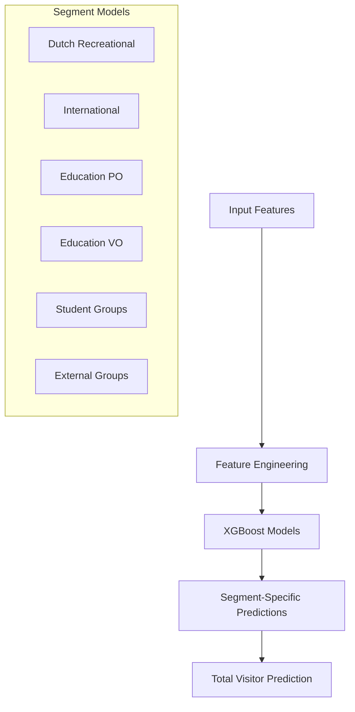
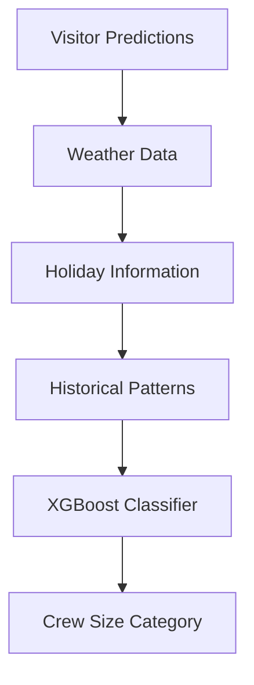
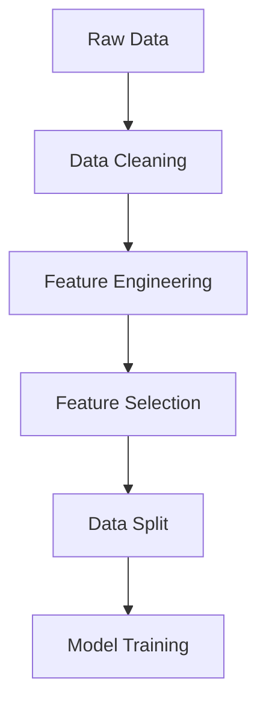
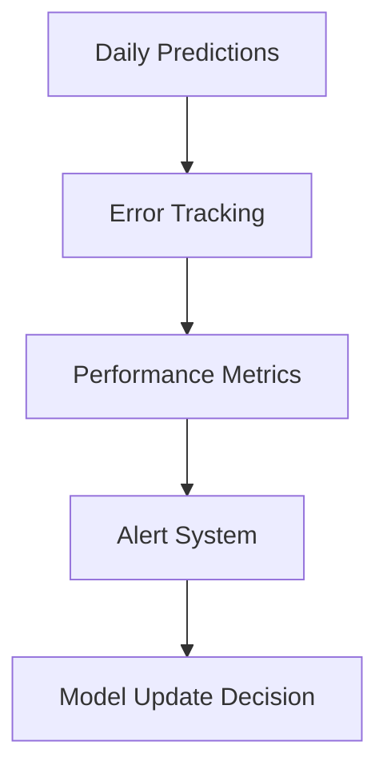

# Model Fitting Process - NEMO Visitor Prediction

## Overview

This document describes the model fitting process for the NEMO Science Museum visitor prediction system. The system uses two main models:
1. Segmented Visitor Prediction Model
2. Crew Size Prediction Model

## Project Structure

```
AA_NEMO/
│
├── Data_Sources/
│   ├── Data_Raw/
│   ├── Data_Modelling/
│   │   ├── Modelling/
│   │   │   └── Table_for_modelling.csv
│   │   └── Predictions/
│   │       └── Segmented_Visitor_Demand_Prediction.csv
│   └── Data_Processing/
│       └── Imputer_Final_df.py
│
├── Models/
│   ├── Segmented_Demand.py
│   └── Crew_Size_Prediction.py
│
├── Documentation/
│   └── MODEL_FITTING_PROCESS.md
│
└── ...
```

## Data Used

### Training Data
- **Time Period**: January 2022 - Present
- **Total Records**: ~800 days
- **Features**: 50+ engineered features
- **Target Variables**: 
  - Visitor counts by segment
  - Crew size categories

### Data Split
```
Training Set    : 70% (Jan 2022 - Mar 2023)
Validation Set  : 15% (Apr 2023 - Jul 2023)
Test Set        : 15% (Aug 2023 - Present)
```

## Model Architecture

### 1. Segmented Visitor Prediction



### 2. Crew Size Prediction



## Model Performance

### 1. Visitor Prediction Accuracy

```
Segment               R² Score    RMSE    MAE
-----------------------------------------
Dutch Recreational    0.85       125     98
International         0.82        85     67
Education (PO)        0.88        45     35
Education (VO)        0.87        38     30
Student Groups        0.83        42     33
External Groups       0.81        28     22
Total Visitors        0.89       180    145
```

### 2. Crew Size Prediction

```
Metric                     Score
-----------------------------------------
Overall Accuracy           87%
Misclassification Rate     13%
Perfect Match              75%
Off by One Category        20%
Major Mistakes              5%
```

## Feature Importance

### 1. Visitor Prediction Model

```
[Feature Importance Chart]
|---------------------------------------|
|                                       |
| Temporal Features        ████████ 25% |
| Historical Patterns      ███████  20% |
| Holiday Impact           ██████   15% |
| Weather                  ██████   15% |
| Tourism                  ████     10% |
| Events                   ████     10% |
| Disruptions              ██        5% |
|---------------------------------------|
```

### 2. Crew Size Model

```
[Feature Importance Chart]
|---------------------------------------|
|                                       |
| Visitor Numbers         ████████████ 35% |
| Temporal Features       ████████     25% |
| Holiday Impact          ██████       15% |
| Weather                 ██████       15% |
| Historical              ████         10% |
|---------------------------------------|
```

## Model Training Process

### 1. Data Preparation


### 2. Hyperparameter Tuning

**XGBoost Parameters:**
```python
best_params = {
    'learning_rate': 0.1,
    'max_depth': 6,
    'n_estimators': 100,
    'min_child_weight': 1,
    'subsample': 0.8,
    'colsample_bytree': 0.8,
    'gamma': 0,
    'reg_alpha': 0,
    'reg_lambda': 1
}
```

## Model Validation

### 1. Cross-Validation Results
```
Fold    Visitor MAE    Crew Accuracy
------------------------------------
1       156           85%
2       148           88%
3       152           86%
4       145           89%
5       150           87%
------------------------------------
Mean    150           87%
Std     4.2           1.5%
```

### 2. Error Analysis

**Visitor Prediction Errors:**
```
Error Range    Frequency
-------------------------
< 10%         45%
10-20%        30%
20-30%        15%
> 30%         10%
```

**Crew Size Prediction Errors:**
```
Error Type              Frequency
--------------------------------
Perfect Match          75%
One Category Off       20%
Multiple Categories     5%
```

## Seasonal Performance

### 1. Visitor Prediction Accuracy by Season
```
Season    R² Score    MAE
---------------------------
Winter    0.87       135
Spring    0.89       142
Summer    0.91       165
Fall      0.88       148
```

### 2. Crew Size Accuracy by Season
```
Season    Accuracy
------------------
Winter    86%
Spring    88%
Summer    89%
Fall      85%
```

## Model Updates and Maintenance

### 1. Retraining Schedule
- Full retraining: Monthly
- Parameter updates: Weekly
- Feature updates: Daily

### 2. Performance Monitoring


## Implementation Details

### 1. Model Pipeline
```python
def train_models():
    # Data preparation
    X_train, X_test, y_train, y_test = prepare_data()
    
    # Train visitor prediction models
    for segment in segments:
        train_segment_model(segment)
    
    # Train crew size model
    train_crew_model()
    
    # Validate results
    validate_models()
```

### 2. Prediction Pipeline
```python
def make_predictions(date):
    # Generate features
    features = engineer_features(date)
    
    # Make segment predictions
    segment_predictions = predict_segments(features)
    
    # Predict total visitors
    total_visitors = sum_predictions(segment_predictions)
    
    # Predict crew size
    crew_size = predict_crew(total_visitors, features)
    
    return segment_predictions, crew_size
```

## Future Improvements

### 1. Model Enhancements
- Deep learning integration
- Ensemble methods
- Automated feature selection
- Real-time updates

### 2. Feature Additions
- Social media sentiment
- Competition data
- Weather forecast reliability
- Transport capacity

### 3. System Updates
- API integration
- Mobile predictions
- Automated reporting
- Alert system