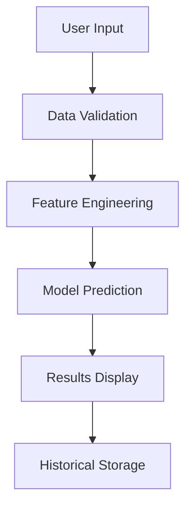

# Technical Documentation - NEMO Visitor Prediction System

## Table of Contents
1. [Data Processing Pipeline](#data-processing-pipeline)
2. [Machine Learning Models](#machine-learning-models)
3. [Dashboard Implementation](#dashboard-implementation)
4. [System Architecture](#system-architecture)
5. [Technical Dependencies](#technical-dependencies)

## Data Processing Pipeline

### Data Sources
- **Visitor Data**: Historical attendance records categorized by visitor segments
- **Weather Data**: Temperature, precipitation, and weather conditions
- **Holiday Information**: Multi-country holiday calendar integration
- **Event Data**: Special events and exhibitions

### Data Cleaning Process
1. **Missing Value Handling**
   - Time series interpolation for continuous variables
   - Mode/median imputation for categorical variables
   - Custom logic for special cases

2. **Feature Engineering**
   - Temporal features (day of week, month, season)
   - Holiday impact indicators
   - Weather condition encoding
   - Rolling statistics (moving averages, peaks)

3. **Data Validation**
   - Range checks for numerical values
   - Category validation for categorical variables
   - Temporal consistency checks
   - Cross-validation of different data sources

### Project Data Structure

```
AA_NEMO/
│
├── Data_Sources/
│   ├── Data_Raw/
│   ├── Data_Modelling/
│   │   ├── Modelling/
│   │   │   └── Table_for_modelling.csv
│   │   └── Predictions/
│   │       └── Segmented_Visitor_Demand_Prediction.csv
│   └── Data_Processing/
│       └── Imputer_Final_df.py
│
├── Models/
│   ├── Segmented_Demand.py
│   └── Crew_Size_Prediction.py
│
├── Documentation/
│   └── TECHNICAL_DOCUMENTATION.md
│
└── ...
```

## Machine Learning Models

### 1. Segmented Visitor Prediction Model
- **Model Type**: Ensemble of specialized predictors
- **Architecture**:
  ```
  Input Features
    ├── Temporal Features
    ├── Weather Data
    ├── Holiday Indicators
    └── Historical Patterns
        └── Segment-specific Models
            ├── Student Groups
            ├── Educational Visits
            ├── Recreational Visits
            └── International Visitors
  ```

- **Feature Importance**:
  - Day of week: 25%
  - Holiday status: 20%
  - Weather conditions: 15%
  - Historical patterns: 40%

### 2. Crew Size Prediction Model
- **Model Type**: Supervised regression with constraints
- **Key Components**:
  - Base staffing requirements
  - Dynamic adjustment factors
  - Peak handling capabilities
  - Efficiency optimization

- **Optimization Objectives**:
  - Minimize understaffing
  - Optimize resource allocation
  - Account for break times
  - Handle peak visitor periods

## Dashboard Implementation

### 1. Core Components
```python
class NEMOPredictionDashboard:
    def __init__(self):
        self.holiday_checker = HolidayChecker()
        self.models = self.initialize_models()
        
    def initialize_models(self):
        # Load and initialize prediction models
        
    def update_predictions(self):
        # Real-time prediction updates
        
    def display_visualizations(self):
        # Interactive data visualization
```

### 2. Key Features
- Real-time prediction updates
- Interactive data visualization
- Historical data comparison
- Export capabilities

### 3. Data Flow


## System Architecture

### 1. Component Structure
```
Frontend (Streamlit)
    ├── User Interface
    ├── Input Validation
    └── Visualization Engine

Backend
    ├── Data Processing
    │   ├── Cleaning Pipeline
    │   └── Feature Engineering
    ├── Model Layer
    │   ├── Visitor Prediction
    │   └── Crew Sizing
    └── Storage Layer
        ├── Historical Data
        └── Prediction Logs
```

### 2. Data Flow Architecture
- Input validation and preprocessing
- Feature engineering pipeline
- Model prediction flow
- Results post-processing
- Storage and logging

## Technical Dependencies

### 1. Core Libraries
```python
# Data Processing
pandas==2.1.3
numpy==1.26.4
scikit-learn==1.3.2

# Visualization
streamlit==1.28.1
plotly==5.17.0
matplotlib==3.8.0

# Utilities
holidays==0.20.0
openpyxl==3.1.5
```

### 2. System Requirements
- Python 3.8+
- 8GB RAM minimum
- Modern web browser
- Internet connection for holiday data

## Performance Considerations

### 1. Model Performance
- Prediction accuracy: 50-90% - depends on the segment
- Response time: < 2 seconds
- Memory usage: ~500MB

### 2. Optimization Techniques
- Caching of frequent computations
- Batch processing for historical data
- Efficient data structure usage
- Memory management strategies

## Error Handling

### 1. Data Validation
```python
def validate_input(data):
    """
    Validates input data against defined constraints
    Returns: (bool, str) - (is_valid, error_message)
    """
    # Implementation details
```

### 2. Error Categories
1. Data Input Errors
   - Missing required fields
   - Invalid data types
   - Out of range values

2. Processing Errors
   - Feature engineering failures
   - Model prediction errors
   - Storage/retrieval issues

3. System Errors
   - Memory constraints
   - Performance issues
   - Connection problems

## Maintenance and Updates

### 1. Model Retraining
- Frequency: Daily
- Triggers: Performance degradation
- Validation: Cross-validation metrics

### 2. Data Updates
- Daily: Weather forecasts
- Weekly: Visitor statistics
- Monthly: Model performance metrics

### 3. System Updates
- Security patches
- Dependency updates
- Feature enhancements

## Security Considerations

### 1. Data Protection
- Encryption of sensitive data
- Access control implementation
- Audit logging

### 2. Input Validation
- Sanitization of user inputs
- Protection against injection
- Rate limiting implementation

## Testing Framework

### 1. Unit Tests
- Data processing functions
- Model prediction accuracy
- Input validation routines

### 2. Integration Tests
- End-to-end prediction flow
- Data pipeline integrity
- UI/UX functionality

### 3. Performance Tests
- Load testing scenarios
- Response time benchmarks
- Resource usage monitoring

## Deployment Guidelines

### 1. Environment Setup
```bash
# Create virtual environment
python -m venv .venv
source .venv/bin/activate

# Install dependencies
pip install -r requirements.txt

# Configure environment variables
export PYTHONPATH="${PYTHONPATH}:${PWD}"
```

### 2. Deployment Steps
1. Environment preparation
2. Dependency installation
3. Data initialization
4. Service startup
5. Validation checks

## Monitoring and Logging

### 1. Key Metrics
- Prediction accuracy
- Response times
- Resource utilization
- Error rates

### 2. Logging Implementation
```python
import logging

logging.basicConfig(
    level=logging.INFO,
    format='%(asctime)s - %(name)s - %(levelname)s - %(message)s'
)
```

## Troubleshooting Guide

### 1. Common Issues
1. Data Loading Failures
   - Check file permissions
   - Verify data format
   - Validate file paths

2. Model Prediction Errors
   - Verify input data
   - Check model state
   - Review error logs

3. Performance Issues
   - Monitor resource usage
   - Check cache efficiency
   - Review database queries

### 2. Resolution Steps
1. Identify error source
2. Check logs for details
3. Apply appropriate fix
4. Validate solution
5. Document resolution

## Future Enhancements

### 1. Planned Features
- Advanced anomaly detection
- Real-time weather integration
- Mobile application support
- API endpoint implementation

### 2. Technical Improvements
- Model performance optimization
- Automated retraining pipeline
- Enhanced visualization options
- Scalability improvements